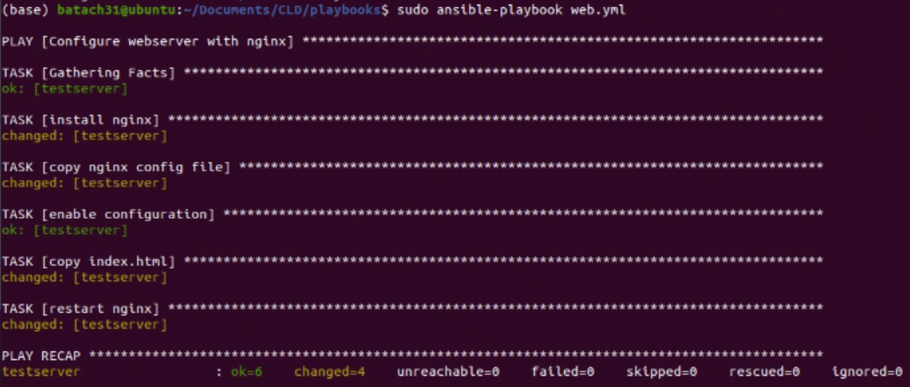
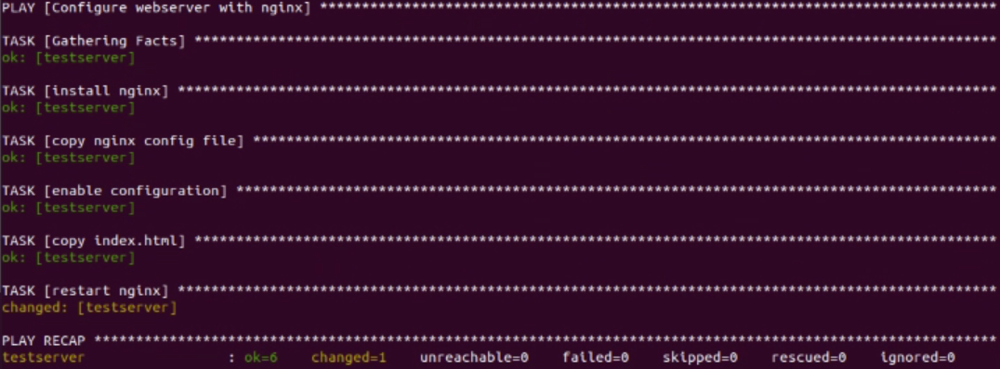
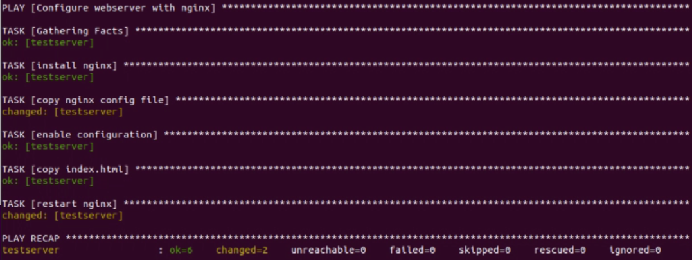
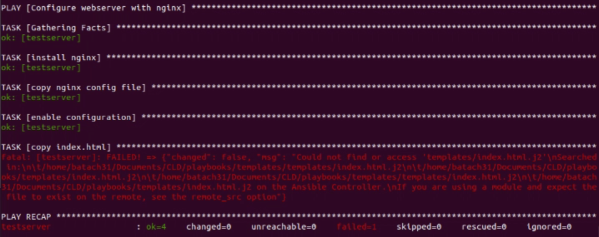
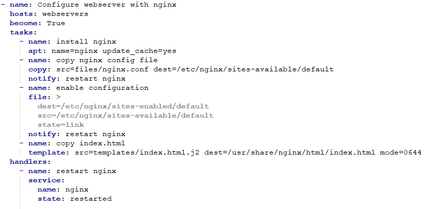
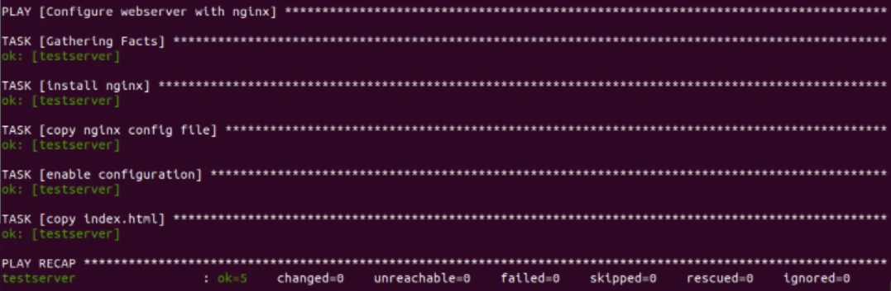

# CLD - Lab 07: Ansible

> Authors : Baptiste Hardrick & David Jaquet

## Task 5: Test desired state configuration principles

1. Return to the output of running the *web.yml* playbook the first time. There is one additional task that was not in the playbook. Which one? Among the tasks that are in the playbook there is one task that Ansible marked as *ok*. Which one? Do you have a possible explanation?
   
   - The screenshot below shows the output of the first output of the command `ansible-playbook web.yml`. We can see the additional task `TASK [Gathering Facts]`.
   
     
   
     Except the *Gathering Facts*, the other task marked as *ok* is the task `TASK [enable configuration]`. We do not specify a configuration for these tasks, so Ansible will use default value.
   
     Source : [medium.com](https://medium.com/@abhijeet.kamble619/10-things-you-should-start-using-in-your-ansible-playbook-808daff76b65)
2. Re-run the *web.yml* playbook a second time. In principle nothing should have changed. Compare Ansible's output with the first run. Which tasks are marked as changed?
   
   - The screenshot below shows the output of the first output of the command `ansible-playbook web.yml`. We can see the task `TASK [restart nginx]` is marked as changed.
   
     
3. SSH into the managed server. Modify the nginx configuration file */etc/nginx/sites-available/default*, for example by adding a line with a comment. Re-run the playbook. What does Ansible do to the file and what does it show in its output?
   
   - For this question, we add a comment in the nginx configuration file */etc/nginx/sites-available/default*. In the screenshot below, we can see Ansible re-copy the nginx configuration file as before the modification. So, the comment is no longer in the file.
   
     
4. Do something more drastic like completely removing the homepage and repeat the previous question.
   
   - For this question we delete the file *index.html.j2* and re-run the command `ansible-playbook web.yml`. The screenshot below shows the output of this command. We can see a fatal error in the task `TASK [copy index.html]`. The process stops at the error and nginx was not restarted.
   
     

## Task 6: Adding a handler for nginx restart

You can find below the new *web.yml* file.

 After we modify the *web.yml* file, we run the command `ansible-playbook web.yml`. As shown in the screenshot below, we do not have the `restart nginx` task and all the tasks as marked as *ok*.

## Task 7: Add more managed servers

1. In AWS create another EC2 instance using the same parameters as before. Add the IP address of that instance to the *webservers* group in the *playbooks/hosts* inventory file.
   - TODO
2. Re-run the *web.yml* playbook. What do you observe in Ansible's output?
   - TODO
3. Test the new server by pointing your web browser to it.
   - TODO
4. What happens if a server is not reachable? Shut down the second instance and re-run the playbook.
   - TODO
5. Suppose you now have 10 web servers in production that you have configured using Ansible. You are working in the IT department of a company and some of your system administrator colleagues who don't use Ansible have logged manually into some of the servers to fix certain things. You don't know what they did exactly. What do you need to do to bring all 10 servers again to the initial state? We'll exclude drastic changes by your colleagues for this question.
   - TODO

### Modification

TODO

### Observation of the Ansible behavior

TODO